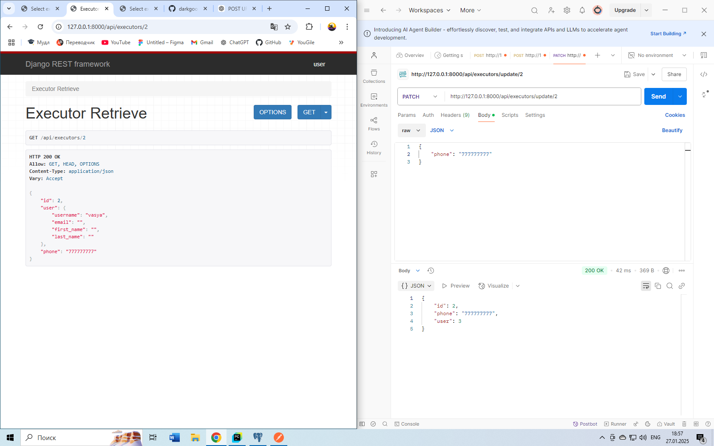

# freelance-exchange

Фриланс платформа для предложения и поиска услуг. Место, где пользователи могут предложить свои профессиональные услуги или найти специалистов для выполнения различных задач. Платформа объединяет исполнителей и заказчиков, обеспечивая удобство взаимодействия и надежность сделок.

## Стек технологий

- Vue 3
- Django Rest Framework
- PostgreSQL

## Установка

1. Клонируйте репозиторий на свою машину:
```
git clone https://github.com/yourusername/your-repository.git
```
2. Перейдите в директорию проекта:
```
cd freelance-exchange
```
3. Установите зависимости:
```
cd backend
cd django_freelance
pip install -r requirements.txt
```
4. Настройте PostgreSQL:
```
CREATE DATABASE freelance_exchange;
```
Укажите настройки подключения в файле settings.py. И примените команды.
```
python manage.py makemigrations
python manage.py migrate 
```
5. Запуск приложения
Для запуска backend (Django Rest Framework):
```
cd backend
cd django_freelance
python manage.py runserver
```
Теперь приложение должно быть доступно по адресу http://localhost:8000.

## Проверка запроса через Postman

